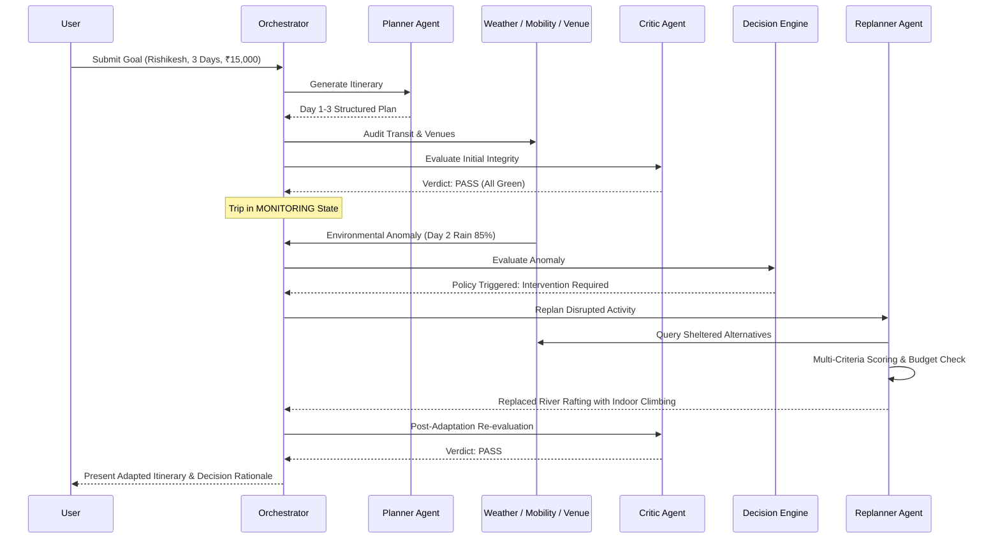

# VoyageOS — Autonomous Travel Planning & Re-Planning Agent

> **"Most travel apps plan your trip. VoyageOS manages it."**

[](LICENSE)
[](https://www.python.org/downloads/)
[]()
[]()

---

## 1. Project Overview

**VoyageOS** is an autonomous AI travel-management agent built for the **Tech Zephyr 4.0 Agentic AI Hackathon (IIT Bhubaneswar)**. Unlike static itinerary generators or generic LLM chatbots that generate text once and forget it, VoyageOS operates as a stateful travel operations system. It synthesizes trip requirements, continuously monitors real-world and simulated signals (weather alerts, venue closures, transit bottlenecks, budget drift), deterministically audits disruptions, and autonomously executes **minimal replanning**—modifying only affected activities while strictly preserving the rest of the journey.

---

## 2. Problem Statement

Current travel-planning applications produce static, brittle itineraries. In the real world, plans fall apart as soon as journeys begin:
- Sudden monsoon downpours cancel white-water rafting or mountain treks.
- Historic monuments or ashrams shut down for unexpected maintenance.
- Highway landslides or city traffic double transit times.
- Incidental expenses threaten financial limits.

When disruptions strike, travelers are left to manually detect issues, research alternative venues, verify operating hours, recalculate transit routes, and recalculate their budgets. This is fundamentally an **adaptive multi-criteria decision-making problem**, not a creative text-generation problem.

---

## 3. Why Agentic AI Is Necessary

A conventional single-turn LLM prompt lacks:
1. **Continuous Environmental Perception:** Cannot monitor changing forecasts or traffic conditions over time.
2. **State & Budget Integrity:** Hallucinates arithmetic, fails to track remaining funds across changes, and loses state upon session reloads.
3. **Deterministic Hard Constraints:** Cannot guarantee that high-risk activities won't be scheduled during torrential rain.
4. **Adaptive Replanning:** Generates brand-new itineraries from scratch, disorienting travelers and discarding already-booked reservations.

VoyageOS implements the closed-loop agentic cycle:
$$\text{Goal} \longrightarrow \text{Decision} \longrightarrow \text{Action} \longrightarrow \text{Evaluation} \longrightarrow \text{Adaptation} \longrightarrow \text{Outcome}$$

---

## 4. Key Features

- 🧭 **Goal Interpretation & Scheduling:** Automatically converts natural-language trip intentions into structured multi-day schedules with morning, afternoon, and evening slots.
- 🌧️ **Continuous Environmental Monitoring:** Actively tracks weather forecasts, venue operating statuses, and road transit conditions.
- 🎯 **Minimal Replanning Principle:** Adapts *only* the affected activity slot. Unaffected days and unaffected slots on the same day remain strictly preserved.
- 🛡️ **Deterministic Decision Engine:** Hard constraints (e.g. $P_{\text{rain}} \ge 70\%$ for outdoor activities; budget ceilings) are evaluated by deterministic policy rules to eliminate hallucinations.
- ⚖️ **Transparent Multi-Criteria Alternative Scoring:** Ranks alternatives using an explainable mathematical formula balancing preferences, safety, budget, transit, and availability.
- 🧪 **What-If Simulation Sandbox:** Allows travelers to explore "What if it rains tomorrow?" scenarios without modifying their active live itinerary.
- 📜 **Audited Autonomous Decision Log:** Every replanning step records timestamp, agent provenance, trigger rationale, and score breakdown.
- 🔄 **Resilient Circuit Fallbacks:** Automatic retries with exponential backoff and graceful failover to certified simulation baselines if external APIs time out.

---

## 5. System Architecture

```
                          USER (UI / CLI / API)
                                    |
                                    v
                          +-------------------+
                          | Goal Interpreter  |
                          +---------+---------+
                                    |
                                    v
                          +-------------------+
                          |   ORCHESTRATOR    | <---+ (Replanning loop)
                          +---------+---------+     |
                                    |               |
                             +------+------+        |
                             |             |        |
                             v             v        |
                      +------------+  +------------+|
                      | Trip State |  | SQLite DB  ||
                      +------------+  +------------+|
                             |                      |
                 +-----------+-----------+          |
                 |           |           |          |
                 v           v           v          |
            +---------+ +---------+ +---------+     |
            | Weather | | Mobility| |  Venue  |     |
            |  Agent  | |  Agent  | |  Agent  |     |
            +----+----+ +----+----+ +----+----+     |
                 |           |           |          |
                 +-----------+-----------+          |
                             |                      |
                             v                      |
                       +-----------+                |
                       |  CRITIC   |                |
                       | / EVAL    |                |
                       +-----+-----+                |
                             |                      |
                             v                      |
                   +---------------------+          |
                   |   Decision Engine   |          |
                   |    Intervention?    |          |
                   +-----+----------+----+          |
                         |          |               |
                        NO         YES              |
                         |          |               |
                         |          v               |
                         |   +-------------+        |
                         |   |  REPLANNER  |--------+
                         |   |  (Minimal)  |
                         |   +-------------+
                         |          |
                         +----------+
                                    |
                                    v
                           +----------------+
                           |  Decision Log  |
                           +-------+--------+
                                   |
                                   v
                             UPDATED PLAN
```

---

## 6. Specialized Agent Responsibilities

| Agent | Module | Core Function |
| :--- | :--- | :--- |
| **Planner Agent** | `app/agents/planner.py` | Synthesizes trip goals into initial day-by-day itineraries. |
| **Weather Agent** | `app/agents/weather.py` | Analyzes meteorological forecasts against scheduled outdoor activities. |
| **Mobility Agent** | `app/agents/mobility.py` | Calculates inter-activity distances, transit durations, and road delays. |
| **Venue Agent** | `app/agents/venue.py` | Monitors venue opening hours and discovers candidate alternatives. |
| **Budget Agent** | `app/agents/budget.py` | Tracks spend against total allowance and evaluates replacement cost viability. |
| **Critic Agent** | `app/agents/critic.py` | Conducts 5-dimensional audit (Budget, Weather, Travel, Venues, Preferences). |
| **Monitoring Agent** | `app/agents/monitor.py` | Surveys environmental signals and aggregates active disruption events. |
| **Replanner Agent** | `app/agents/replanner.py` | Executes targeted substitution of disrupted activities while preserving unaffected slots. |

---

## 7. The Agentic Workflow



---

## 8. Technology Stack

- **Core Backend:** Python 3.11+, Pydantic v2 (type-safe structured schemas)
- **Workflow & Graph State:** Custom stateful conditional graph engine (`WorkflowGraph`)
- **Persistence:** SQLite with thread-safe JSON snapshot serialization (`app/database/`)
- **Interactive UI:** Streamlit (custom styled with responsive status grids and metrics)
- **Testing:** Pytest & Pytest-Cov (13 automated unit & integration tests)
- **Tooling & Resilience:** Custom circuit breaker with exponential backoff (`execute_with_resilience`)

---

## 9. Installation

### Prerequisites
- Python 3.11 or higher
- Git

### Setup Instructions
```bash
# 1. Clone the repository
git clone https://github.com/Priyank-14/voyage-os.git
cd voyage-os

# 2. Create and activate a virtual environment
python -m venv .venv
# On Windows PowerShell:
.venv\Scripts\Activate.ps1
# On Linux / macOS:
source .venv/bin/activate

# 3. Install dependencies
pip install -r requirements.txt
```

---

## 10. Environment Variables

Copy the `.env.example` template to `.env`:
```bash
cp .env.example .env
```

| Variable | Description | Default |
| :--- | :--- | :--- |
| `VOYAGEOS_ENV` | Application environment (`development` / `production`) | `development` |
| `VOYAGEOS_DEBUG` | Enable debug telemetry | `true` |
| `VOYAGEOS_MODEL_PROVIDER` | LLM Provider (`mock` / `gemini` / `openai`) | `mock` |
| `OPENWEATHER_API_KEY` | (Optional) OpenWeatherMap API Key | None |
| `GOOGLE_MAPS_API_KEY` | (Optional) Google Maps API Key | None |
| `DATABASE_PATH` | Path to SQLite database file | `data/voyageos.db` |
| `RAIN_DISRUPTION_THRESHOLD_PERCENT` | Rain probability threshold to trigger outdoor replan | `70.0` |

> **Note:** VoyageOS includes certified fallback adapters and realistic simulation profiles. The application runs 100% reliably even without external API keys.

---

## 11. Running Locally

### Option A: Interactive Streamlit Dashboard (Recommended)
```bash
streamlit run app/ui/dashboard.py
```
Open your browser at `http://localhost:8501`.

### Option B: Automated CLI Demo Scenario
```bash
python -m app.main --cli
```
Executes the full end-to-end hackathon demonstration scenario directly in your terminal.

### Option C: Run Test Suite
```bash
pytest -v tests/
```

---

## 12. Primary Demonstration Scenario

**Prompt:** *"Plan a 3-day trip to Rishikesh for ₹15,000 with adventure activities and good food."*

1. **Goal:** VoyageOS sets a ₹15,000 budget ceiling and schedules:
   - **Day 1:** Cafe hopping, Neer Garh waterfall trek, Beatles Ashram.
   - **Day 2:** River Rafting at Shivpuri, Riverside lunch, Triveni Ghat Aarti.
   - **Day 3:** Yoga & Sound Healing, Chotiwala feast, local craft market.
2. **Evaluation:** Critic audits budget (₹6,150 projected spend), transit times, and preferences. Verdict: `PASS`.
3. **Disruption Injected:** An 85% rainstorm probability is reported for Day 2.
4. **Decision:** Decision Engine verifies Policy #1: Outdoor rafting during heavy rain is unsafe.
5. **Replanning:** Replanner searches sheltered indoor candidates, verifies budget, and selects **Indoor Rock Climbing & Bouldering Zone** (₹900).
6. **Minimal Replanning Verified:**
   - **Day 1:** PRESERVED (100% untouched)
   - **Day 2 Morning:** REPLACED with Indoor Rock Climbing (saves ₹600, preserves adventure preference)
   - **Day 2 Afternoon & Evening:** PRESERVED
   - **Day 3:** PRESERVED (100% untouched)

---

## 13. Failure Handling & Resilience

VoyageOS is engineered for real-world reliability:
- **API Outages:** Wrapped in `execute_with_resilience`. If external weather or maps endpoints time out, the system automatically retries with backoff and fails over to certified local baseline models.
- **Budget Protection:** If an alternative exceeds the remaining budget margin, the Decision Engine deterministically rejects it.
- **Duplicate Protection:** Prevents scheduling activities whose names are already present on other trip days.

---

## 14. UI Layout & Dashboard

The Streamlit dashboard is structured into five operational views:
- **📍 Live Trip Operations:** Trip summary, real-time agent status pills, budget gauge, active alerts, and day-by-day interactive itinerary cards.
- **🤖 Autonomous Decision Log:** Chronological, color-coded audit trail detailing timestamp, agent provenance, trigger rationale, and multi-criteria scoring breakdowns.
- **🔄 Before vs After (Delta):** Side-by-side comparison showing original vs adapted plan to visually prove minimal replanning.
- **🧪 What-If Simulator:** Sandbox allowing travelers to simulate hypothetical disruptions without modifying their active trip.
- **📊 Observability & System Stream:** Real-time log telemetry stream displaying internal agent transitions.

---

## 15. Limitations

- **Prototype Scope:** Curated activity databases currently focus on major adventure destinations (e.g. Rishikesh); other destinations use heuristic baseline catalogs.
- **Direct Bookings:** The current version produces an actionable operational schedule, but does not process payment transactions with third-party ticketing vendors.
- **Local Transit Granularity:** Inter-activity transit uses regional road matrices rather than live turn-by-turn GPS tracking.

---

## 16. Responsible AI & Safeguards

- **Safety-First Routing:** High-risk outdoor activities (white-water rafting, bungee jumping) are automatically restricted during severe weather advisories.
- **Zero Hallucinated Finances:** Financial arithmetic is handled by deterministic code, preventing LLM budget overruns.
- **Explainability:** Travelers are never presented with arbitrary changes; every replanning decision is accompanied by a plain-language explanation and evidence.
- **Data Privacy:** No personal credentials or private travel documents are collected or logged.

---

## 17. Future Improvements

- **Multi-Modal Transit Optimization:** Dynamic integration with real-time public transit feeds (trains, regional buses).
- **Group Consensus Agent:** Multi-traveler voting and preference reconciliation for family or group trips.
- **Live Flight Disruption Sync:** Direct webhook integration with airline flight tracking APIs to adapt trip starts upon flight cancellations.

---

## 18. Team & Authors

- **Priyank Sinha** — Full-Stack & Agentic AI Architecture ([@Priyank-14](https://github.com/Priyank-14))
- **Tech Zephyr 4.0** — Agentic AI Hackathon, IIT Bhubaneswar

---

## 19. License

This project is licensed under the MIT License. See [LICENSE](LICENSE) for details.

---

## 20. Acknowledgements & Third-Party APIs

- [Streamlit](https://streamlit.io/) for the interactive operations dashboard.
- [Pydantic](https://docs.pydantic.dev/) for type-safe data modeling.
- [OpenWeatherMap](https://openweathermap.org/) for meteorological forecast data structures.
- [OpenStreetMap](https://www.openstreetmap.org/) & [OSRM](http://project-osrm.org/) for geospatial distance references.
