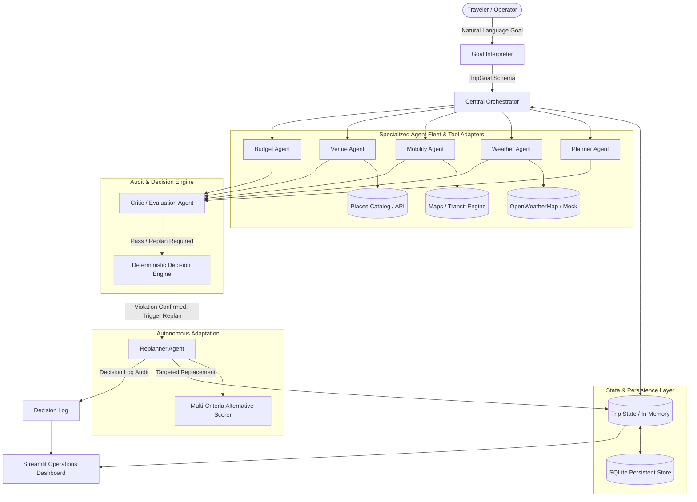
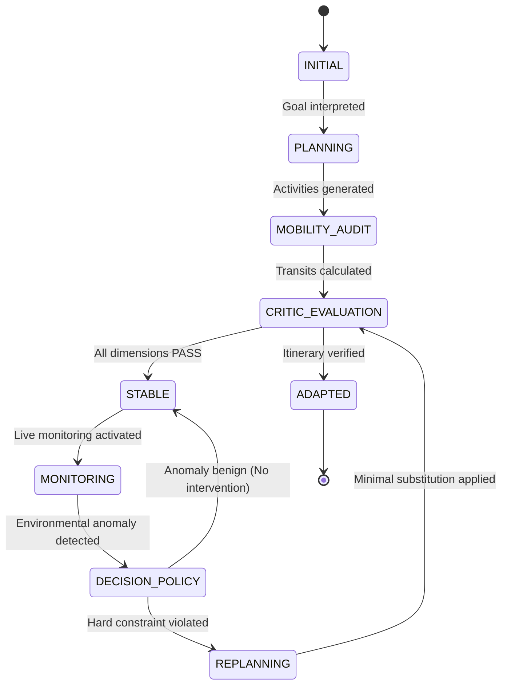
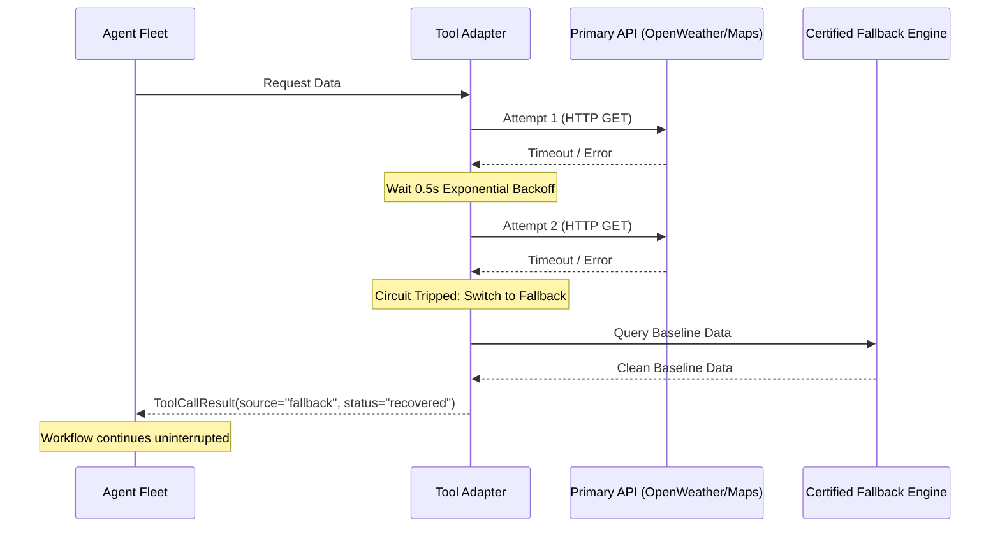

# VoyageOS System Architecture & Technical Specification

## 1. System Architecture Overview



---

## 2. Agentic Workflow State Diagram

The system progresses through explicit workflow states defined in `app/orchestration/graph.py`:



---

## 3. Core Component Specifications

### 3.1 Goal Interpreter & Trip State
* **Goal Interpreter:** Translates user input into a strongly‑typed `TripGoal` Pydantic model.
* **TripState:** Holds `budget_total`, `budget_used`, `budget_remaining`, `itinerary`, `active_disruptions`, `decision_log`, and `itinerary_history`.
* **Database (`app/database/`):** Persistent SQLite store with automatic schema creation and JSON snapshot serialization.

### 3.2 Specialized Agents
| Agent | Responsibility | Tool Integration |
| --- | --- | --- |
| Planner Agent | Synthesizes goals into multi‑day schedules. | `PlacesTool` |
| Weather Agent | Analyzes precipitation, storms, temperature vs outdoor activities. | `WeatherTool` |
| Mobility Agent | Audits travel times, distances, transit congestion. | `MapsTool` |
| Venue Agent | Monitors venue hours, closures, discoverability. | `PlacesTool` |
| Budget Agent | Enforces hard financial ceilings, audits cost deltas. | Internal calculations |
| Critic Agent | Conducts 5‑dimensional audit (budget, weather, travel, venues, preferences). | Multi‑Agent state |
| Monitoring Agent | Background scanner detecting real‑time environmental drift. | Perception fleet |
| Replanner Agent | Applies Minimal Replanning Principle to adapt disrupted slots. | `AlternativeScorer` |

---

## 4. Deterministic Decision Engine & Policies
**Policy 1 – Weather Safety**
```
IF (P_rain >= 70% OR is_storm = True) AND activity.is_outdoor = True => TRIGGER_REPLAN
```
**Policy 2 – Venue Availability**
```
IF venue.operating_status IN {"CLOSED", "SUSPENDED"} => TRIGGER_REPLAN
```
**Policy 3 – Budget Ceiling**
```
IF alternative.cost <= (budget_remaining + old_activity.cost) => PASS else REJECT
```

---

## 5. Multi‑Criteria Alternative Scoring
When the Replanner searches candidates, each candidate is ranked by:
```
Score = w_pref·P_match + w_const·C_satisfaction + w_budg·B_fit + w_trav·T_efficiency + w_safe·W_safety
```
| Dimension | Default Weight | Measurement |
| --- | ---: | --- |
| Preference Match | 0.30 | 1.0 for direct category or continuity, 0.8 partial, 0.5 default |
| Constraint Satisfaction | 0.25 | 1.0 indoor during bad weather, 0.0 otherwise |
| Budget Fit | 0.20 | Scaled savings ratio |
| Travel Efficiency | 0.15 | Proximity to central hub |
| Weather / Safety | 0.10 | 1.0 sheltered indoor, 0.1 exposed outdoor |

---

## 6. Minimal Replanning Principle
When a disruption is confirmed on Day *k*:
1. Unaffected days `D \setminus {k}` remain unchanged.
2. Unaffected activities on Day *k* stay unchanged.
3. Only the disrupted activity is replaced by the top‑scoring candidate.
4. An itinerary snapshot is persisted for before/after comparison.

---

## 7. Failure Recovery Architecture


---

## 8. Grand Finale Adaptability
The architecture abstracts the problem space into:
- **Domain Goals → Abstracted Constraints**
- **Perception Tools → Sensor Adapters**
- **Critic Engine → Multi‑Dimensional Objective Function**
- **Replanner → Targeted Item Replacement**

In the 24‑Hour Grand Finale, swapping travel tools (weather, places) for disaster‑response tools (flood gauges, shelter capacities) requires zero changes to the underlying graph, database, or replanning engine.


## 1. High-Level Architecture


---

## 2. Stateful Workflow Graph

The system transitions across explicit stages governed by `app/orchestration/graph.py`:


---

## 3. Core Component Specifications

### 3.1 Goal Interpreter & Trip State
- **Goal Interpreter:** Translates input into strongly-typed Pydantic model `TripGoal`.
- **TripState:** Maintains `budget_total`, `budget_used`, `budget_remaining`, `itinerary`, `active_disruptions`, `decision_log`, and `itinerary_history`.
- **Database (`app/database/`):** Persistent SQLite store backing `trips` with automatic schema creation and JSON snapshot serialization.

### 3.2 Specialized Agents
| Agent | Responsibility | Tool Integration |
| :--- | :--- | :--- |
| **Planner Agent** | Synthesizes goals into structured multi-day schedules. | `PlacesTool` |
| **Weather Agent** | Analyzes precipitation, storms, and temperature against outdoor activities. | `WeatherTool` |
| **Mobility Agent** | Audits travel times, inter-activity distances, and transit congestion. | `MapsTool` |
| **Venue Agent** | Monitors venue opening hours, maintenance closures, and discoverability. | `PlacesTool` |
| **Budget Agent** | Enforces hard financial ceilings and audits alternative cost deltas. | Internal Math |
| **Critic Agent** | Conducts 5-dimensional audit (Budget, Weather, Travel Time, Venues, Preferences). | Multi-Agent State |
| **Monitoring Agent** | Autonomous background scanner detecting real-time environmental drift. | Perception Fleet |
| **Replanner Agent** | Applies Minimal Replanning Principle to adapt disrupted slots. | `AlternativeScorer` |

---

## 4. Deterministic Decision Engine & Policies

To prevent non-deterministic hallucinations in safety-critical logistics, VoyageOS couples LLM reasoning with deterministic policy rules:

### Policy 1: Weather Safety Enforcement
$$\text{IF } \left( P_{\text{rain}} \ge 70\% \lor \text{is\_storm} = \text{True} \right) \land \text{activity.is\_outdoor} = \text{True} \implies \text{TRIGGER\_REPLAN}$$

### Policy 2: Venue Availability Enforcement
$$\text{IF } \text{venue.operating\_status} \in \{\text{"CLOSED"}, \text{"SUSPENDED"}\} \implies \text{TRIGGER\_REPLAN}$$

### Policy 3: Budget Ceiling Viability
$$\text{IF } \text{alternative.cost} \le (\text{budget\_remaining} + \text{old\_activity.cost}) \implies \text{PASS else REJECT}$$

---

## 5. Transparent Multi-Criteria Alternative Scoring

When the Replanner searches candidate alternatives, candidates are ranked using the formula:

$$\text{Score} = w_{\text{pref}} \cdot P_{\text{match}} + w_{\text{const}} \cdot C_{\text{satisfaction}} + w_{\text{budg}} \cdot B_{\text{fit}} + w_{\text{trav}} \cdot T_{\text{efficiency}} + w_{\text{safe}} \cdot W_{\text{safety}}$$

| Dimension | Default Weight ($w$) | Measurement Logic |
| :--- | :---: | :--- |
| **Preference Match** | `0.30` | 1.0 for direct category match or category continuity (e.g. adventure $\to$ adventure); 0.8 for partial match; 0.5 default. |
| **Constraint Satisfaction** | `0.25` | 1.0 if indoor during bad weather; 0.0 if outdoor during storm or violating user avoidances. |
| **Budget Fit** | `0.20` | Scaled score based on savings ratio relative to maximum allowable spend. |
| **Travel Efficiency** | `0.15` | Proximity to central hub (Tapovan / Laxman Jhula) vs peripheral mountain locations. |
| **Weather / Safety** | `0.10` | 1.0 for sheltered indoor venues during inclement forecasts; 0.1 for exposed outdoor. |

---

## 6. Minimal Replanning Principle

When a disruption is confirmed on Day $k$:
1. Unaffected days $D \setminus \{k\}$ are strictly preserved.
2. Unaffected activities on Day $k$ are strictly preserved.
3. Only the disrupted activity $A_{\text{disrupted}}$ is replaced with top candidate $A^*$.
4. Itinerary history snapshot is persisted for side-by-side before/after delta visualization.

---

## 7. Failure Recovery Architecture


---

## 8. Grand Finale Adaptability

The architecture abstracts the problem space into:
- **Domain Goals** $\to$ Abstracted Constraints
- **Perception Tools** $\to$ Sensor Adapters
- **Critic Engine** $\to$ Multi-Dimensional Objective Function
- **Replanner** $\to$ Targeted Item Replacement

In the 24-Hour Grand Finale, swapping travel tools (weather, places) for disaster response tools (flood gauges, shelter capacities) requires zero changes to the underlying graph, database, or replanning engine.
